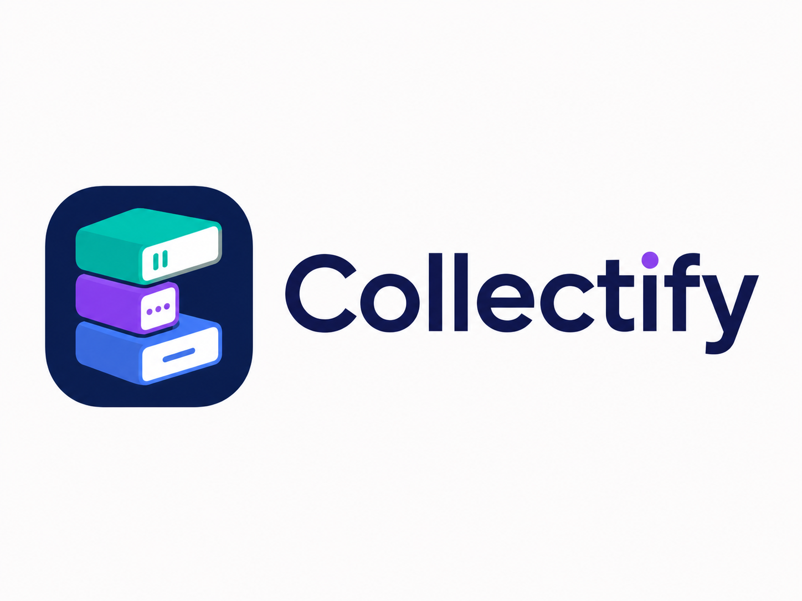
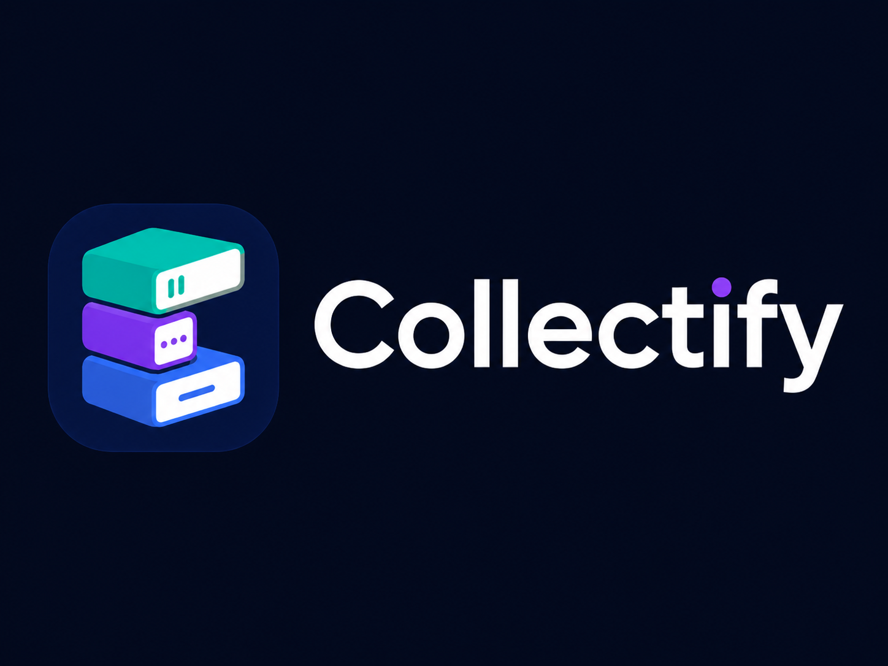

# Collectify Design

## Overview

Collectify should feel like a private, well-kept media shelf: calm enough for daily cataloging, bright enough to make collecting feel satisfying. The `DESIGN` assets establish a friendly dimensional mark, a deep navy brand base, and three stacked collection blocks that map naturally to movies, music, and games.

The product should lean into the sample artwork's promise: self-hosted, private, open source, and owned by the user. Those qualities should show up through clear status surfaces, direct language, and predictable controls rather than heavy marketing copy.

## Source Assets

- `src/client/public/brand/collectify-logo.png`: primary app icon. Use for favicons, app icons, login/setup surfaces, and brand moments.
- `src/client/public/brand/collectify-banner-light.png`: light brand banner. Use for documentation, README imagery, and light marketing surfaces.
- `src/client/public/brand/collectify-banner-dark.png`: dark brand banner. Use on dark hero surfaces, release images, and social previews.
- `src/client/public/brand/collectify-sample.png`: product direction reference. Use as the strongest guide for layout tone, icons, self-hosted messaging, and category treatment.

Keep the artwork undistorted. Do not crop into the stacked media blocks or recolor the logo. The icon's rounded navy square and dimensional blocks are the brand signature.

## Color

The palette is built around a deep navy base with bright media accents:

- **Navy 900 (`#071333`)**: primary text, dark backgrounds, app chrome, and brand grounding.
- **Navy 800 (`#0B1C4D`)**: elevated dark-mode panels and logo-compatible surfaces.
- **White (`#FFFFFF`)**: clean app background, card surfaces, logo faceplates, and high-contrast text on dark navy.
- **Mist (`#F7F9FF`)**: light app background and quiet page bands.
- **Line (`#DCE4F6`)**: borders, dividers, search fields, and inactive controls.
- **Teal (`#14C8B6`)**: movies, server/ownership status, success confirmations.
- **Violet (`#7C3FF2`)**: music, primary actions, active navigation, focus states.
- **Blue (`#2F6FF2`)**: games, storage/server blocks, secondary emphasis.
- **Green (`#16C7A9`)**: verified status checks and healthy system states.

Use accent color semantically. A routine collection screen should usually feature one active category accent at a time. Multi-accent compositions are best reserved for brand, dashboard summary, onboarding, and empty states.

## Typography

Use **Inter** across the interface. The wordmark and sample banner favor large, heavy, geometric text with a friendly stance.

- Display text should be bold, compact, and reserved for setup, login, dashboard welcome, and marketing imagery.
- Page headings should be direct: "My Collection", "Movies", "Music", "Games", "Tags", "Settings".
- Body text should stay practical and short. This is a utility app first.
- Metadata should be smaller, medium weight, and navy/gray rather than washed out.
- Labels can be compact and high confidence, but avoid excessive all-caps in dense forms.

## Layout

The sample asset suggests a split between navigation, collection cards, and self-hosting status. Translate that into the app with a clear shell:

- Use a left navigation rail on desktop and a compact top or bottom navigation pattern on small screens.
- Keep primary routes visually distinct: Dashboard, Movies, Music, Games, Tags, Settings.
- Use card grids for collection browsing, with cover art or category iconography as the visual anchor.
- Use compact status panels for "up to date", "backed up", "running smoothly", and other self-hosted health signals.
- Keep search and add actions close to the collection title, as shown in the product sample.

Recommended page rhythm:

- App gutters: 24px on mobile, 32px on tablet, 40px to 48px on desktop.
- Card gap: 16px for dense grids, 24px for dashboard groups.
- Form gap: 16px between fields, 24px between sections.
- Navigation rail width: 72px collapsed, 220px expanded if labels are shown.

## Shape & Depth

The brand mark is soft, dimensional, and rounded. Product surfaces should echo that without becoming toy-like.

- Controls: 12px radius.
- Collection cards: 18px radius.
- Large panels and modals: 24px to 28px radius.
- App icon: preserve the rounded-square shape from `src/client/public/brand/collectify-logo.png`.

Use soft navy-tinted shadows in light mode and subtle inner contrast in dark mode. Avoid harsh black shadows, glassmorphism-heavy blur, and generic gray enterprise cards.

## Components

### Navigation

Navigation should use simple media icons that match the sample: home, film, music note, game controller, settings. Active state uses violet on a pale violet pill in light mode and violet glow or high-contrast fill in dark mode.

### Collection Cards

Cards should feel like media cases or shelf items:

- Show cover art when available.
- Use category accents for the icon, progress/status bar, or small chip.
- Keep title and key metadata readable without forcing the user into detail view.
- Reserve larger gradients for empty states or generated placeholder covers.

### Buttons

Primary actions use violet with white text. Secondary actions use white or mist surfaces with navy text and a clear border. Destructive actions should introduce a separate red token instead of reusing violet, teal, or blue.

### Inputs

Search fields and forms should be calm and legible:

- 44px minimum height.
- Navy text on white.
- Visible violet focus ring.
- Placeholder text that remains clearly secondary.
- Error text with a dedicated error color if introduced.

### Status Panels

Self-hosting is part of the brand. Use compact status rows with green checks for healthy states and direct operational labels such as "Up to date", "Backed up", and "Running smoothly". Avoid burying these cues in long explanatory copy.

## Dark Mode

Dark mode should look like `src/client/public/brand/collectify-banner-dark.png`: deep, polished, and high contrast.

- Background: navy 900.
- Panels: navy 800 with a restrained border.
- Primary text: white.
- Secondary text: pale blue-gray.
- Accent states: violet for active/focused, teal or green for healthy status, blue for games.

Do not use pure black as the main background. The brand lives in navy.

## Accessibility

- Maintain WCAG AA contrast for all text-bearing components.
- Do not rely on color alone for categories; pair colors with icons or labels.
- Preserve 44px minimum touch targets.
- Keep focus states visible in both light and dark mode.
- Avoid tiny icon-only controls unless a tooltip or accessible label is present.

## Do

- Use the `DESIGN` assets as the source of truth for brand tone.
- Keep the interface organized, private, and self-hosted in feel.
- Let movies, music, and games have consistent category accents.
- Use rounded cards, stable grids, and clear status indicators.
- Prefer useful product UI over decorative marketing sections.

## Don't

- Distort, recolor, or tightly crop the logo.
- Turn every screen into a three-color rainbow.
- Replace navy with generic black, gray, or beige.
- Use low-contrast placeholder text or faint controls.
- Overload amber/yellow for games if a warning state is later needed; add a dedicated warning token.
