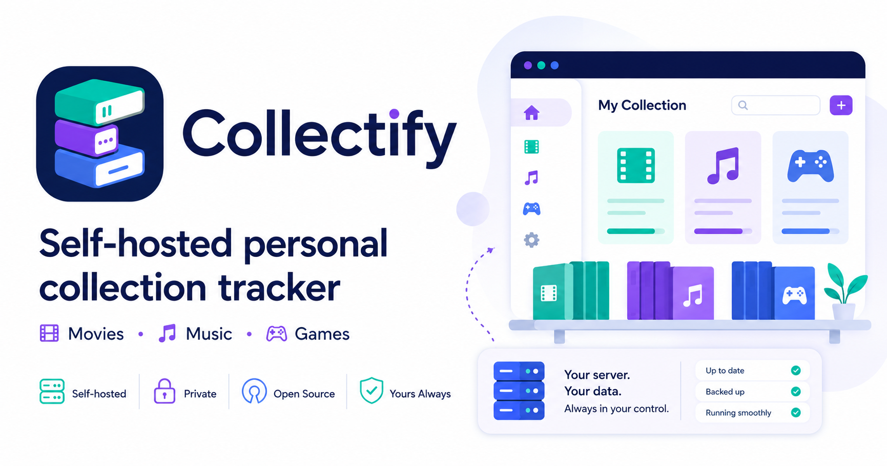

# Collectify



A self-hostable web app for tracking your personal collection of **movies** (DVD / Blu-ray / UHD Blu-ray), **music** (CDs / vinyl), and **videogames** (physical and digital).

> **Status:** Phase 1 complete — manual entry, edit, search for all three types. Internet metadata lookup (TMDB / MusicBrainz / IGDB) and barcode camera scanning are included. Single-user with password, packaged as a Docker image.

## Quick start

```bash
docker compose up -d
```

Open <http://localhost:8080>. The first visit sends you to **/setup** to create your account; after that you log in at **/login**.

Data is persisted to a named Docker volume `collectify-data` (mounted at `/data` inside the container, holds `collectify.db`).

The container follows the LinuxServer-style `PUID`/`PGID` convention. On startup it runs a small root entrypoint, ensures `/data` is owned by the configured IDs, then drops privileges before launching Collectify. Both values default to `1000`:

```bash
PUID=$(id -u) PGID=$(id -g) docker compose up -d
```

For named volumes the defaults usually work. For bind mounts, set `PUID` and `PGID` to the host user that should own the data directory.

### PostgreSQL (optional)

Collectify defaults to SQLite (zero-config, single-file DB). If you prefer PostgreSQL for persistence, backups, or operational tooling:

```bash
docker compose -f docker-compose.yml -f docker-compose.postgres.yml up -d
```

This adds a `postgres` service and configures Collectify to use it. Data lives in the `collectify-postgres-data` named volume. The database is created automatically on first boot. Schema evolution uses
`EnsureCreated()` (not EF migrations) — if the model changes, you need to
reset the `collectify-postgres-data` volume and let it recreate.

For your own Postgres instance, set the connection string in `.env`:

```
Collectify__Database__Provider=postgres
Collectify__Database__ConnectionString=Host=my-db;Port=5432;Database=collectify;Username=collectify;Password=secret
```

The connection string user needs `CREATEDB` permission so the app can create the database on first run. Subsequent starts just apply migrations.

### Configuration

Copy `.env.example` to `.env`, set the variables you need, and restart:

```bash
cp .env.example .env   # edit API keys here
docker compose restart
```

All provider keys are optional — lookups degrade gracefully when unconfigured. The container reads `.env` via `env_file` in [`docker-compose.yml`](docker-compose.yml), so every variable flows into the runtime automatically.

#### Metadata lookup providers

| Provider | Variable(s) | Required? | Purpose |
|---|---|---|---|
| **TMDB** (movies) | `Collectify__Metadata__Tmdb__ApiKey` | Yes | Movie title search, cover images. Get a v3 key at [themoviedb.org](https://www.themoviedb.org/settings/api). |
| **MusicBrainz** (music) | `Collectify__Metadata__MusicBrainz__UserAgent` | Yes | Music release lookup by barcode/title. Format: `"AppName/Version (contact@example.com)"`. No API key needed — the User-Agent is your identity per [their etiquette policy](https://musicbrainz.org/doc/MusicBrainz_API#etiquette). |
| **IGDB** (games) | `Collectify__Metadata__Igdb__TwitchClientId`<br>`Collectify__Metadata__Igdb__TwitchClientSecret` | Both | Game title search and cover images. Create a Twitch app at [dev.twitch.tv](https://dev.twitch.tv/console/apps). |
| **UPCitemdb** (barcode fallback) | *(none)* | No | Free trial endpoint, IP rate-limited (~100/day). Used for movies/games when TMDB/IGDB don't recognize a UPC. Override `Collectify__Metadata__Upc__BaseUrl` only for tests or paid-tier swaps. |

#### Other settings

| Variable | Default | Purpose |
|---|---|---|
| `Collectify__Metadata__CacheTtl` | `30.00:00:00` | How long a cached lookup stays fresh (`.NET TimeSpan`). |
| `Collectify__Auth__AllowRegistration` | `false` | Flip to `true` to expose `/register` and allow sign-ups. |

See [`.env.example`](.env.example) for the full list including optional base URL overrides.

### Changing the image source

Override via environment variables or a `.env` file:

| Variable | Default | Purpose |
|---|---|---|
| `REGISTRY` | `ghcr.io` | Registry host |
| `IMAGE_NAME` | `mforce/collectify` | Image path inside the registry |
| `TAG` | `latest` | Image tag (`v0.1.0`, `v0.1`, etc.) |

Example — pulling from a self-hosted Gitea registry:

```bash
REGISTRY=git.example.com IMAGE_NAME=mforce/collectify TAG=v0.1.0 docker compose up -d
```

## Local development without Docker

Two terminals:

```bash
# Terminal 1 — API on :5041 (default from launchSettings)
cd src/server
dotnet run --project Collectify.Api

# Terminal 2 — Vite dev server on :5173, proxies /api → :5041
cd src/client
npm install
npm run dev
```

The Vite dev server proxies `/api/*` calls to the .NET app, so you get hot reload on the React side while the API rebuilds on changes.

### Building from source (Docker)

Use the development compose override to build locally instead of pulling:

```bash
docker compose -f docker-compose.yml -f docker-compose.dev.yml up --build
```

## Stack

- ASP.NET Core 10 (Minimal APIs) + EF Core + SQLite
- React 18 + Vite + TypeScript + Tailwind + TanStack Query
- ASP.NET Identity (cookie auth, designed to extend to multi-user)
- Docker + docker-compose, single container

## Project layout

```
src/
  server/
    Collectify.slnx               # solution file (also references the client folder)
    Collectify.Api/               # ASP.NET Core API + serves React build
    Collectify.Domain/            # Entities + enums
    Collectify.Infrastructure/    # EF Core DbContext, Identity, metadata clients
    tests/Collectify.Tests/       # xUnit tests
  client/                         # Vite + React + TS frontend (sources at root, no nested src/)
Dockerfile                        # multi-stage: node → React, sdk → publish, aspnet → runtime
docker-compose.yml                # consumer compose (pull from registry)
docker-compose.dev.yml            # dev override (build from source)
```

## Barcode scanning

The "Scan barcode" button on each form uses the device camera via
`@zxing/browser` (lazy-loaded — the ~450 KB decoder bundle only ships
when a user actually scans). Browsers gate `getUserMedia` on a **secure
context**, so the scanner only works at:

- `http://localhost` / `http://127.0.0.1` (during development), or
- `https://…` URLs (production).

Plain HTTP on a LAN address (e.g. `http://192.168.x.x:8080`) will surface
"Camera access requires a secure context" instead of a viewfinder. To
test from a phone, terminate TLS at a reverse proxy (Caddy, Traefik,
Nginx + Let's Encrypt) or generate a local cert with
[`mkcert`](https://github.com/FiloSottile/mkcert).

Backend dispatch:

- **Music** → MusicBrainz `release?query=barcode:CODE` (no UPC round-trip).
- **Movies / Games** → UPCitemdb's free trial endpoint resolves the code
  to a product title, then TMDB / IGDB run their normal title search.
  UPCitemdb is rate-limited (~100 lookups/day on the free tier); every
  result is cached in `LookupCache` so a re-scan is free.

## Contributing

### Enable the git hooks

Once per clone:

```bash
git config core.hooksPath .githooks
```

- **`pre-commit`** — a fast build tripwire for the stacks a commit touches (skip with `--no-verify` or `SKIP_HOOKS=1`).
- **`commit-msg`** — rejects a subject that isn't a conventional header, and a body line that would silently break the changelog (see below). It cannot see a PR title, so a multi-commit PR's title is still yours to get right.

CI runs the full suite (build, xUnit, image build + Trivy, boot smoke) on every PR regardless — the hooks are a local convenience, not a substitute.

### Writing a commit message

Commits (and **PR titles**) are [Conventional Commits](https://www.conventionalcommits.org/): `type(scope): summary`. release-please reads them to build `CHANGELOG.md` and pick the next version.

| type | changelog section | bump | example |
|---|---|---|---|
| `feat` | Features | minor | `feat(movies): add UHD Blu-ray format` |
| `fix` | Bug fixes | patch | `fix(scan): reject empty barcode` |
| `perf` | Performance | patch | `perf(lookup): cache TMDB responses` |
| `refactor` | Refactoring | patch | `refactor(api): extract owner filter` |
| `docs` | Documentation | patch | `docs: note the mkcert TLS option` |
| `ci` `build` `chore` `test` `style` | *(hidden)* | patch | `chore(deps): bump react-router` |

A `feat!:` subject or a `BREAKING CHANGE:` footer bumps the minor (below 1.0.0) or major (at/above). Hidden types stay out of the changelog *text* but still move the version.

**A prefix that isn't on this list parses as nothing** — no changelog line, no bump, on a green run. The ones that look right but aren't: `feature:` (use `feat:`), `bug:` (use `fix:`), and bare subjects like `update` or `Phase 2:`. When unsure, `chore:` is the safe hidden-but-parseable default.

**Why it matters that PR titles count:** PRs squash-merge, and GitHub uses the **PR title** as the squashed commit subject for a multi-commit PR — so the PR title *is* the release note. A body line that starts at column 1 with a nested-paren shape (`Assert.Single(AllMigrations())`) breaks release-please's parser and drops the **whole** commit from the changelog; the `commit-msg` hook catches that locally and prints the fix.

<!-- #113: a "Releases & container images" section (deploy-by-digest recipe,
     provenance verification) will be added here once release-please lands. -->

## Roadmap

See [GitHub issues](https://github.com/mforce/collectify/issues) for the active roadmap. Phases:

- **Phase 1 — Foundation** (done): scaffolding, auth, manual CRUD, Docker.
- **Phase 2 — Internet lookup** (done): TMDB / MusicBrainz / IGDB providers + cover caching.
- **Phase 3 — Barcode scanning** (done): in-browser webcam UPC scan with `@zxing/browser`.
- **Phase 4 — Multi-user.**
- **Phase 5 — Photo-snap visual lookup** (future).
